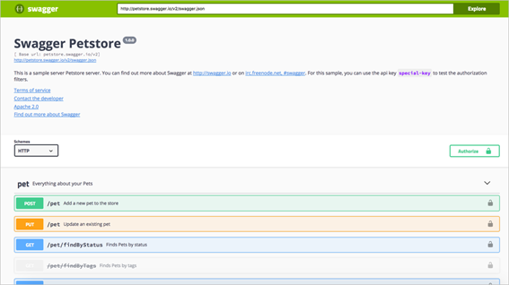

[Home](../README.md)

---
### ♦ O Swashbuckle é importante?

Swashbuckle é o nome da biblioteca Swagger utilizada em projetos .NET.

[Swagger](https://swagger.io/) é um framework para descrição, consumo e visualização de serviços RESTful.

As vantagens de utilizar o Swagger são basicamente: Modelar e documentar APIs REST.

O objetivo é permitir que a documentação possa evoluir no mesmo ritmo da implementação, já que pode ser gerada automaticamente com base em anotações do código.

O Swagger tem um módulo de user interface que permite aos desenvolvedores interagirem com as APIs em sandbox de forma muito intuitiva como podemos ver na imagem abaixo, sem exigir conhecimento da implementação ou mesmo dos parâmetros e opções (que são explícitas na documentação).

Exemplo:

