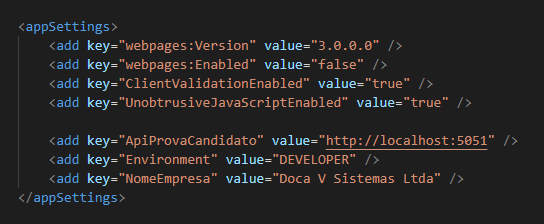
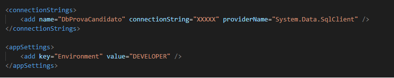

# ProvaCandidato

Problemática de criação do projeto: [prova-asp-net-mvc.docx](./prova-asp-net-mvc.docx)

Trata-se de um sistema dividido em FrontEnd e BackEnd desenvolvido na linguagem .NET Framework 4.8.

---
## FrontEnd

Possui como entrada um projeto **ASP.NET Web MVC**, é um projeto desenvolvido para o ambiente Web e suas principais bibliotecas são as seguinte:

- [Bootstrap (5.1.3)](./Docs/Bootstrap.md)
- [JQuery (3.6.0)](./Docs/JQuery.md)
- [Newtonsoft.Json (13.0.1)](./Docs/Newtonsoft.Json.md)
- [RestSharp (107.1.2)](./Docs/RestSharp.md)

A estrutura do FrontEnd consiste em:

    .  
    ├── 1.ProvaCandidato.Web                # Apresentação de dados
    │   ├── App_Start                       # Arquivos de configuração do projeto
    │   ├── Assets                          # Imagens utilizadas em telas
    │   ├── Content                         # Arquivos CSS
    │   ├── Controllers                     # Controladores das telas
    │   ├── Scripts                         # Arquivos JavaScript
    │   ├── ViewModels                      # Modelos das telas
    │   └── Views                           # Telas
    |
    ├── 2.ProvaCandidato.Application        # Consumo de apis
    │   └── ApiProvaCandidato               # Chamadas da api
    |
    └── 3.ProvaCandidato.Utils              # Utilitário
        ├── Commons                         # Retornos pradronizados
        └── Environment                     # Váriaveis de Ambiente

---
## BackEnd

Possui como entrada um projeto **ASP.NET Web Api**, é um projeto desenvolvido para o ambiente Web e suas principais bibliotecas são as seguinte:

- [Unity (5.11.10)](./Docs/Unity.md)
- [Swashbuckle (5.6.0)](./Docs/Swashbuckle.md)
- [Swashbuckle.Core (5.6.0)](./Docs/Swashbuckle.md)
- [Newtonsoft.Json (13.0.1)](./Docs/Newtonsoft.Json.md)
- [Dapper (2.0.123)](./Docs/Dapper.md)

Utiliza o conceito de [Microsserviço Orientado a DDD](https://docs.microsoft.com/pt-br/dotnet/architecture/microservices/microservice-ddd-cqrs-patterns/ddd-oriented-microservice) e [Injeção de Dependência](https://docs.microsoft.com/pt-br/dotnet/core/extensions/dependency-injection), por isso possui os seguintes benefícios ([acesse o link para ver na integra](https://enlabsoftware.com/development/domain-driven-design-in-asp-net-core-applications.html)):

1. **Acoplamento fraco:** As partes do sistema irão interagir umas com as outras através das definições e princípios estabelecidos na camada Core (interfaces, classes abstratas, classes base, etc.). As implementações serão concluídas nas camadas restantes. A configuração da implementação será por meio de bibliotecas DI (Unity). Portanto, as equipes podem se desenvolver de forma independente ao mesmo tempo.

1. **Flexibilidade:** Os links soltos e as definições de alto nível permitem que a equipe aprimore e se adapte a novos requisitos funcionais de forma mais flexível, sem impacto considerável no sistema geral.

1. **Testabilidade:** Conforme mencionado acima, separando a implementação das interfaces definidas na camada Core, é permitido testar com dados simulados em um ambiente separado.

1. **Manutenção:** DDD divide claramente as funções entre camadas/camadas. Especificamente, o Domínio implementa a lógica de negócios, a Infraestrutura é responsável pela persistência dos dados e o Aplicativo lida com a API e a lógica de integração. Seguindo essa abordagem, você terá a chance de escrever códigos mais limpos e confiáveis. Além disso, sua equipe pode encontrar facilmente o código, limitar sua duplicação e reduzir o tempo de manutenção.

A estrutura do BackEnd consiste em:

    .  
    ├── 1.ProvaCandidato.Api                # Endpoints
    │   ├── App_Start                       # Arquivos de configuração do projeto
    │   ├── Controllers                     # Controladores dos endpoints
    │   └── Resolver                        # Gerenciador de Injeção de Dependência
    |
    ├── 2.ProvaCandidato.Domain             # Regras de Negócio    
    |
    ├── 3.ProvaCandidato.Infra              # Manipulação de Dados
    |
    └── 4.ProvaCandidato.Utils              # Utilitários
        ├── Commons                         # Retornos pradronizados
        ├── Connections                     # Conexões com Banco de Dados
        └── Environment                     # Váriaveis de Ambiente

---
## Uso

O primeiro passo é a execução dos scripts SQL para criação do banco de dados e suas tabelas, abra seu gerenciador de banco de dados e execute os scripts presentes na pasta [ScriptsSql](./ScriptsSql), ordem de execução:

1. create-database.sql
2. create-cidade.sql
3. create-cliente.sql

Com todos scripts sql executados abra o projeto .NET e restaure as dependencias, aconselhável fazer uso do Visual Studio e .Nuget, o próximo passo é definir os projetos a serem iniciados.

Fazendo uso do Visual Studio 2022 em idioma Inglês, clique com botão direito do mouse na:

```
Solution -> Properties
```

Será exibido uma caixa com as opções:

```
Common Properties -> Startup Project
```

Marque a opção `Multiple Startup Projets`, em seguida nos projetos `1.ProvaCandidato.Web` e `1.ProvaCandidato.Api` escolha a opção `Start`, veja:


O passo seguinte é a correção das strings de conexão com banco de dados e variáveis de ambiente presente no Web.config.

1. Abra o `./Web/ProvaCandidato.Web/Web.config`, encontre a seção `appSettings`, corrija as variáveis **ApiProvaCandidato** e **NomeEmpresa**:

    

2. Abra o `./Api/ProvaCandidato.Api/Web.config`, encontre a seção `connectionStrings`, corrija a variável **DbProvaCandidato**:

    

### PRONTO!

Assim já será possível iniciar o projeto e navegar pelas suas funcionalidades.

---
## Principais Rotas

    /Home           # Acessa a problemática de criação deste sistema
    /Cidade         # Acessa o CRUD de Cidades
    /Cliente        # Acessa o CRUD de Clientes

